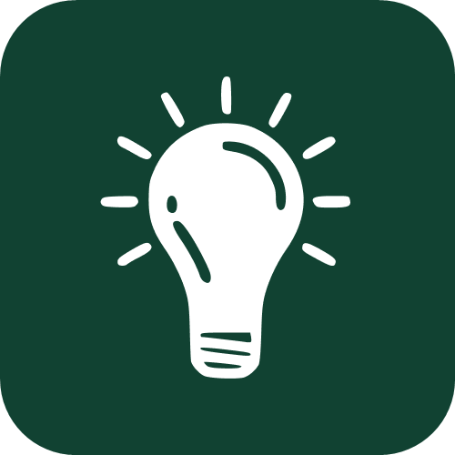
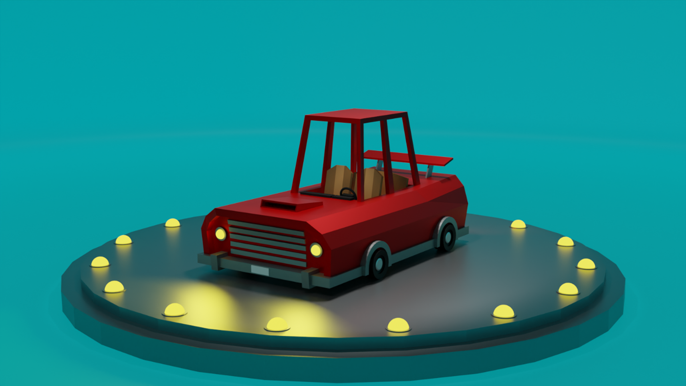
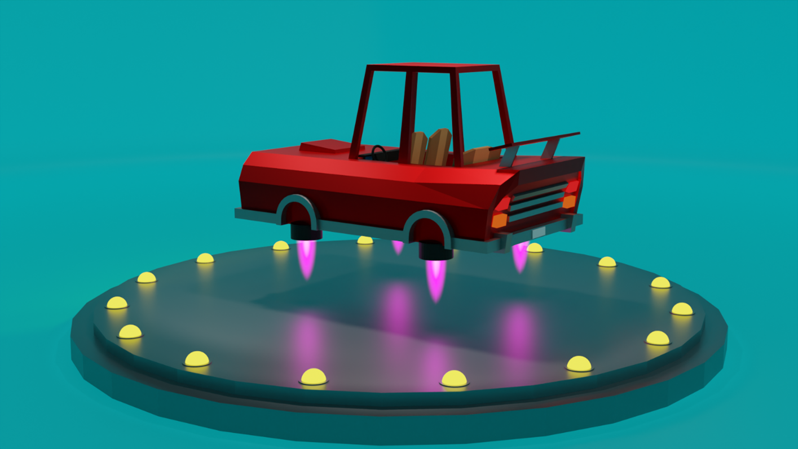
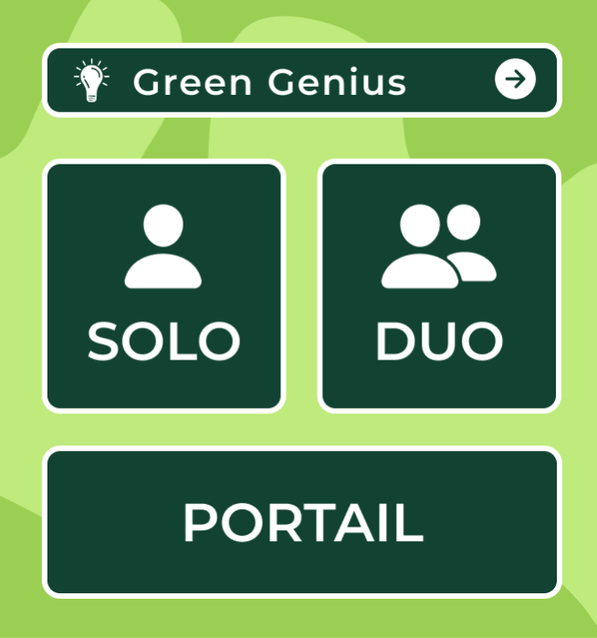
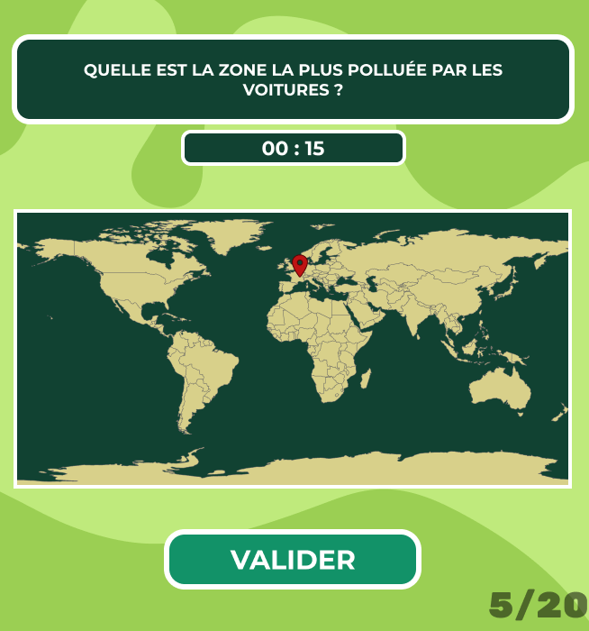
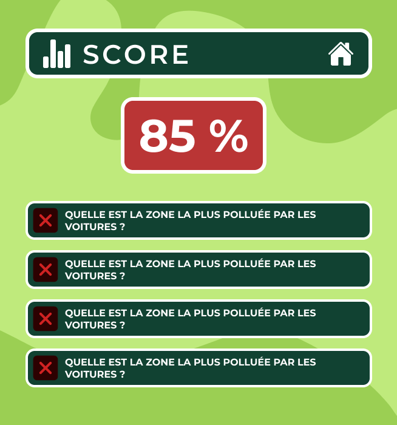
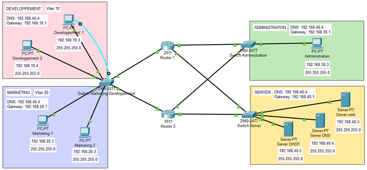

# Green Genius

**Green Genius** est un projet de fin d'études lié à la simulation d'une entreprise de jeux vidéo, **GreenGame**. L'objectif est de développer un environnement immersif et éducatif à travers un jeu vidéo comportant deux éléments majeurs : 

1. **GreenGenius** – Un modèle 3D interactif et un quiz éducatif sur des thématiques liées à l'écologie.
2. **GreenGame** – L'infrastructure réseau de l'entreprise simulée, modélisée dans **Cisco Packet Tracer**.



# Table des matières

1. [📂 Structure du projet](#-structure-du-projet)
   - [Multimédia](#multimédia)
   - [Programmation](#programmation)
   - [Réseaux](#réseaux)
2. [🌟 Explications détaillées](#-explications-détaillées)
   - [GreenGame](#greengame)
   - [GreenGenius](#greengenius)
3. [🚀 Installation](#-installation)
4. [📓 Documentation](#-documentation)
5. [🌍 Site Web](#-site-web)
6. [🔧 Technologies utilisées](#-technologies-utilisées)
7. [🛡️ Licence](#️-licence)
8. [🖋️ Auteur](#️-auteur)
9. [📸 Aperçu](#-aperçu)
   - [Modèles 3D](#modèles-3d)
   - [Application Green Genius](#application-green-genius)
   - [Infrastructure réseau](#infrastructure-réseau)

<p style="height:50px"><P>


## 📂 Structure du projet

### **Multimédia**
Ce dossier contient les éléments graphiques et vidéos nécessaires au projet, notamment les modèles 3D et animations.


```
Multimedia/ 
├── Animation - 1.blend 
├── Animation - 2.blend 
├── Animation - 3.blend 
├── Models.blend 
└── Video/ 
```

### **Programmation**
Tous les fichiers relatifs au code source du jeu GreenGenius et à son installateur sont organisés comme suit :

```
Programmation/ 
├── CodeSource/ 
│ ├── assets/ 
│ ├── data/ 
│ ├── display/ 
│ ├── env/ 
│ ├── main.py 
│ ├── other/ 
│ └── widgets/ 
├── Installateur/ 
│ └── Green Genius - Setup - Windowsx64 - 1.0.0.exe 
```

### **Réseaux**
Le système réseau simulé de l'entreprise GreenGame est conçu à l'aide de **Cisco Packet Tracer**.

```
SE-Logiciel/ 
└── Resaux.pkt
```
<p style="height:50px"><P>

---

## 🌟 Explications détaillées

### **GreenGame**
GreenGame simule une entreprise de jeux vidéo composée d'une équipe multidisciplinaire comprenant : 
- **Développeurs logiciels** – Créateurs du jeu GreenGenius.
- **Ingénieurs réseau** – Responsable de la conception et de la gestion du système réseau de l'entreprise.
- **Designers 3D** – Créateurs des modèles et animations 3D utilisés dans le jeu.

L'objectif de GreenGame est de sensibiliser les joueurs à l'écologie et aux innovations vertes, tout en offrant une expérience de jeu immersive.

### **GreenGenius**
GreenGenius est le produit phare de GreenGame. Il combine :
1. **Modèles et animations 3D** – Une exploration visuelle interactive avec des graphismes modernes.
2. **Jeu de quiz éducatif** – Un jeu engageant conçu pour éduquer les joueurs sur des sujets variés, tels que les énergies renouvelables, la réduction des déchets, et l'impact environnemental.

Le jeu est conçu pour être :
- **Interactif** – Avec des animations et des quiz dynamiques.
- **Éducatif** – En intégrant des faits écologiques et des solutions innovantes.
- **Accessible** – Disponible sur Windows via un installateur intuitif.
<p style="height:50px"><P>

---

## 🚀 Installation

1. Téléchargez l'installateur depuis : [Green Genius - Setup - Windowsx64 - 1.0.0.exe](Programmation/Installateur/Green%20Genius%20-%20Setup%20-%20Windowsx64%20-%201.0.0.exe).
2. Lancez l'exécutable et suivez les instructions pour installer le jeu.
3. Profitez de l'expérience GreenGenius !
<p style="height:50px"><P>

---
## 📓 Documentation
Un rapport complet décrivant les aspects techniques et conceptuels du projet est disponible au format Word : [Rapport](Rapport.docx)

## 🌍 Site Web
Un site web a été créé pour permettre le téléchargement du jeu et fournir des informations complémentaires :  
👉 [Site officiel de Green Genius](https://green-genius-download.firebaseapp.com/)


## 🔧 Technologies utilisées

- **Python** – Langage principal pour le développement du jeu.
- **Blender** – Création des modèles et animations 3D.
- **Cisco Packet Tracer** – Conception et simulation du réseau.
- **Windows** – Plateforme cible pour l'installateur.
<p style="height:50px"><P>

---

## 🛡️ Licence

Ce projet est sous licence MIT. Consultez le fichier [LICENSE](LICENSE) pour plus d'informations.


## 🖋️ Auteur

Développé par [Xen0r-star](https://github.com/xen0r-star) (Florian) pour son projet de fin d'études.  
**Contact** : green.genius.quiz@gmail.com
<p style="height:50px"><P>

---

## 📸 Aperçu

### Modèles 3D



### Application Green Genius




### Infrastructure réseau

