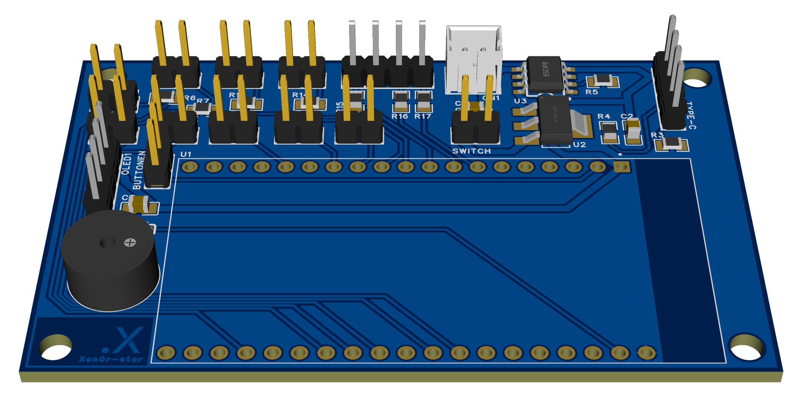
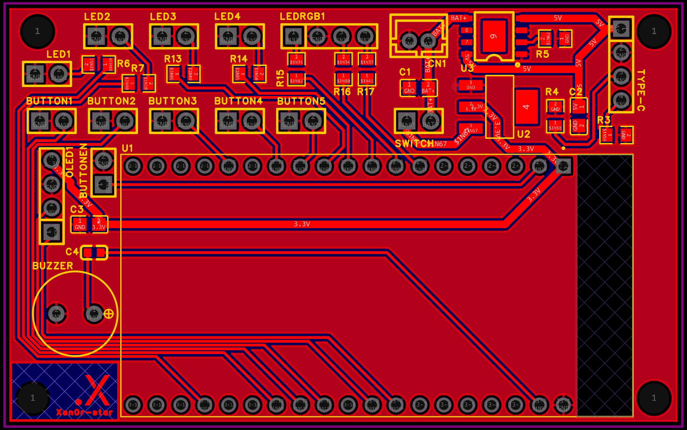
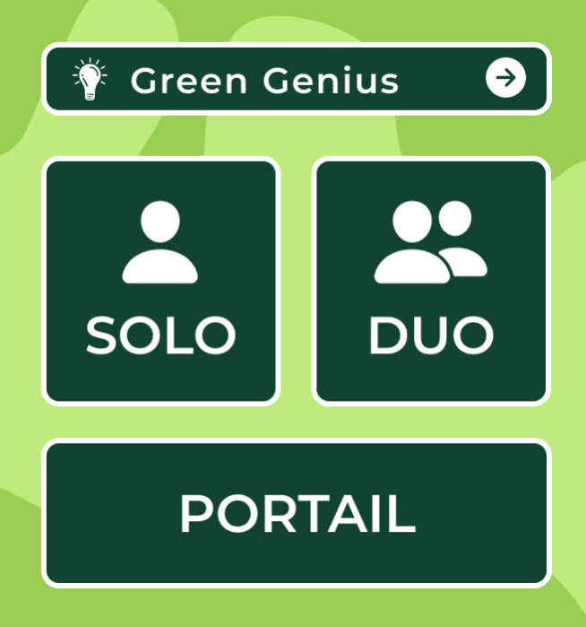
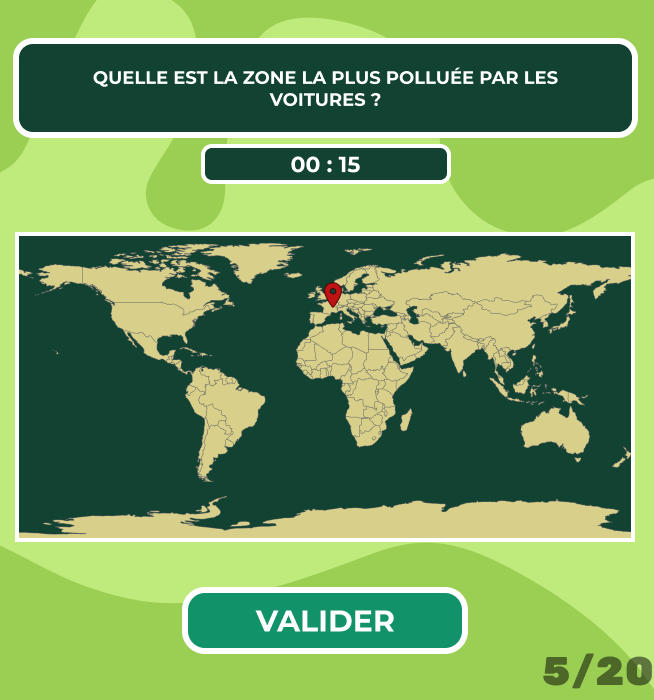
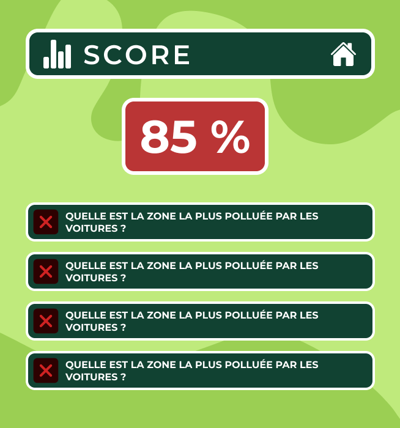
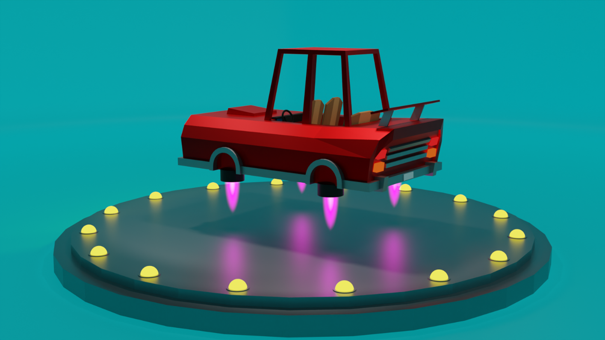
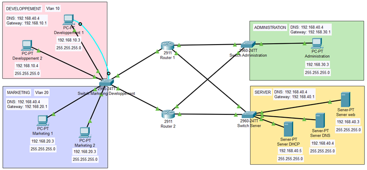

# Green Genius

**Green Genius** is an educational video game ecosystem and end-of-studies project focusing on ecology and environmental awareness. It features three main pillars:

1. 🎮 **Software:** A 3D interactive quiz game built with Python.
2. 🕹️ **Hardware:** A custom ESP32-powered physical controller that connects via Wi-Fi to play the game remotely.
3. 🌐 **Network:** A corporate network infrastructure simulated in Cisco Packet Tracer for the fictional studio "GreenGame".

## 📂 Structure

- `3D_Assets/` — Blender models and animations
- `Docs/` — Project reports and documentation
- `Hardware/` — ESP32 console PCB designs and schematics
- `Images/` — Visual assets and screenshots
- `Network/` — Cisco Packet Tracer simulation (`.pkt`)
- `Software/` — Python source code and game assets

## 🚀 Getting Started

1. **Play on PC:** Download the installer from the [official website](https://green-genius-download.firebaseapp.com/) or run the game via Python.
2. **Use the Console:** Power on the custom ESP32 hardware, connect it to the same local network, and enter the game's room code on the device.

## 🛠️ Info & Tech Stack

- **Stack:** Python (Pygame), C/C++ (ESP32), EasyEDA, Blender, Cisco Packet Tracer.
- **Documentation:** [Full Project Report](Docs/Rapport.docx)
- **Website:** [Green Genius Download Page](https://green-genius-download.firebaseapp.com/)
- **Author:** [Xen0r-star](https://github.com/xen0r-star)
- **License:** MIT License

## 📸 Previews & Gallery

### 🔌 Hardware Console & PCB

### 🎮 Green Genius Application

### 🎨 3D Models

### 🌐 Network Infrastructure

